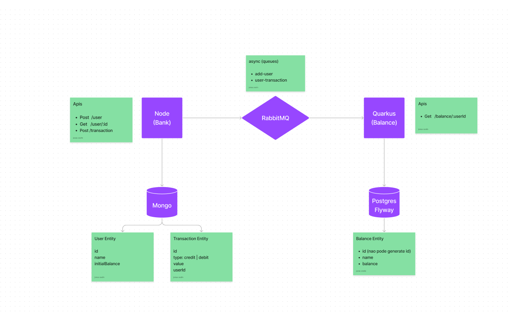

# Application
This repository was made with Quarkus, Rabbitmq, flyway and provide some endpoints.
To connect to postgresql, Hibernate ORM Panache was used. The project was deploy with minikube.

# Architecture


## Start the rabbitmq, mongo, postgresql
Start using:
```shell script
docker-compose up -d


## Packaging and running the application

The application can be packaged using:
```shell script
./mvnw package
```
It produces the `getting-started-kafka-1.0.0-SNAPSHOT-runner.jar` file in the `/target` directory.
Be aware that it’s not an _über-jar_ as the dependencies are copied into the `target/lib` directory.

If you want to build an _über-jar_, execute the following command:
```shell script
./mvnw package -Dquarkus.package.type=uber-jar
```

The application is now runnable using `java -jar target/getting-started-kafka-1.0.0-SNAPSHOT-runner.jar`.

## Creating a native executable

You can create a native executable using: 
```shell script
./mvnw package -Pnative
```

Or, if you don't have GraalVM installed, you can run the native executable build in a container using: 
```shell script
./mvnw package -Pnative -Dquarkus.native.container-build=true
```